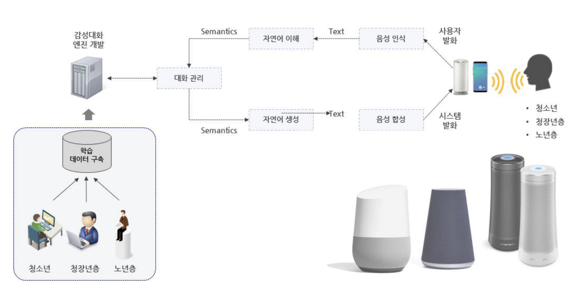
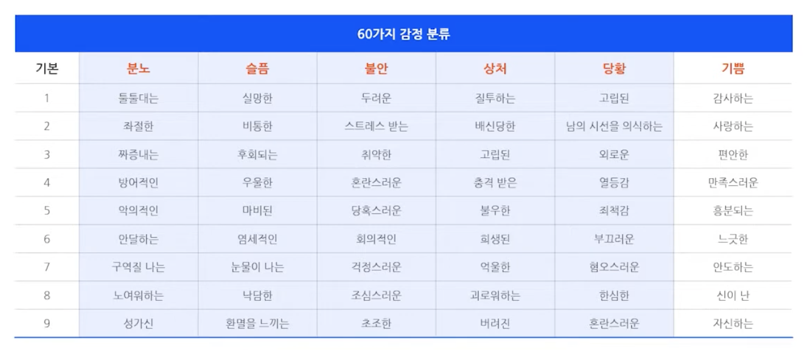
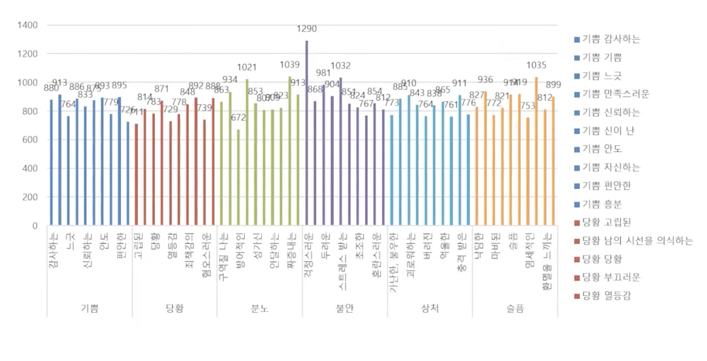
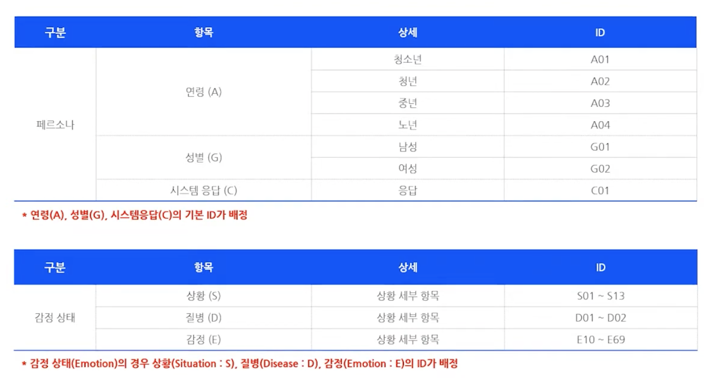
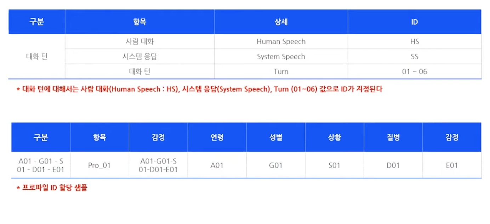
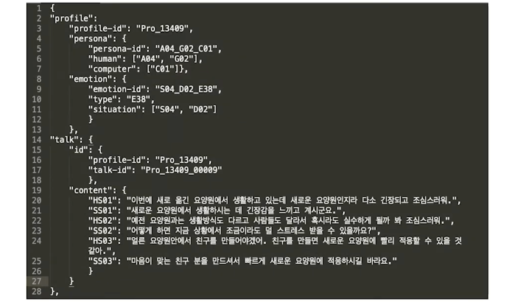

# Aihub Dataset

본 데이터는 [Aihub](https://aihub.or.kr/aihubdata/data/view.do?currMenu=115&topMenu=100&aihubDataSe=realm&dataSetSn=86)에서 제공하는 감성 대화를 위한 챗봇을 학습시키기 위한 데이터셋입니다.

## 감성 대화 말뭉치 Dataset 정보

#### 소개

크라우드 소싱 수행으로 일반인 1,500명을 대상으로 하여 음성 15,700문장 및 코퍼스 27만 문장 구축 및 세대별 감성 대화 텍스트 구축을 통해 감성 대화 엔진을 개발하여 세대별 감성 대화 서비스 제공

#### 구축목적

감정 인식을 위한 데이터는 크롤링이 불가능하기 때문에 직접 제작해야 하는 희소성 있는 데이터임. 60가지의 세부 감정에 대한 자연어 처리 말뭉치를 확보함으로써 다양한 AI 산업에 활용이 가능함

* 데이터 구축 연도 : 2020년
* 10,000문장 (음성)
* 27만문장 (코퍼스)

| 구분             | 내용                                                                       |
| ---------------- | -------------------------------------------------------------------------- |
| 데이터 구축 범위 | 감성 텍스트 언어 수집                                                       |
|                  | 우울증 관련 언어 의미 구조화 및 대화 응답 시나리오 동반 수집                  |
| 데이터 구축 규모 | 음성 약 10,000 발화, 코퍼스 27만 문장 수집/태깅                               |
|                  | 일반인 1,500명 대상의 인터뷰 및 크라우드 소싱 수행                            |
|                  | 우울증 환자 대상 WOZ 대화 수집                                              |
| 데이터 구축 일정 | 총 5개월 소요 예정                                                          |
|                  | 데이터 설계 및 인프라 구축 1개월, 데이터 수집/태깅 3개월, 데이터 품질 검수 1개월 |

본 데이터 구축 목적은 대화 속에서 부정적 감정 상태가 감지되면 긍정적 방향으로 대화를 이끌어 갈 수 있는 대화체 구어 코퍼스를 수집하는 것입니다.

데이터는 총 27만 문장 규모의 텍스트 데이터와 1만 문장의 평가용 음성 녹음 데이터입니다.

주로 심리적인 요인에 의해 사용자의 감정 상태가 부정적으로 나타나는 것을 인식하는 데 주안점을 두었습니다.

감정 상태는 총 6가지로 크게 분류되며 각 대분류 감정은 각각 10개씩 소분류 항목으로 나뉘어 총 60가지의 감정 체계로 이루어집니다.

각 감정별 데이터 분포 역시 균등한 수집을 고려하였습니다.

데이터는 JOSN 형식으로 정리가 되었고, 이에 대한 ID 규칙을 페르소나 및 감정 상태에 따라 분류되어 있습니다.

대화의 턴도 중요한 정보이므로 ID를 부여합니다.

챗봇 대화의 전략은 심리 상담에서 활용하는 적극적 경청의 방법을 활용하고 있습니다.

| 우리 누나가 열심히 아르바이트한 돈으로 나에게 아이패드를 사줬어 !    |
| ------------------------------------------------------ |
| 누나에게 선물을 받아서 기분이 좋겠어요.                      |

| 나 결국 미술을 포기하게 되어 너무 슬퍼.                      |
| ------------------------------------------------------ |
| 미술을 포기하게 되어 슬프시군요.                           |
| 응. 맞아 부모님의 반대가 너무 심해.                          |

